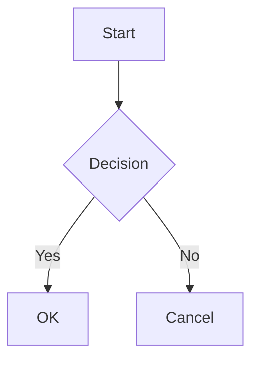
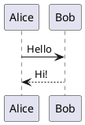

# CLAUDE.md

This file provides guidance to Claude Code (claude.ai/code) when working with code in this repository.

## Project Overview

This is a Slidev presentation project. Slidev is a markdown-based presentation tool for developers that supports Vue components, code highlighting, animations, and various themes.
**The presentation is about Claude Code, at the time of writing (2026 December 4th)** - use context7 to get recent information about it - its core concepts and feedback about real life usage in an enterprise context. It includes some demos into the actual coding environment.

## Commands

```bash
pnpm install        # Install dependencies
pnpm dev            # Start dev server at http://localhost:3030
pnpm build          # Build static site (outputs to dist/)
pnpm export         # Export slides to PDF/PNG
```

Note: The dev server is interactive (keyboard shortcuts: r=restart, o=open, e=edit, q=quit). To run non-interactively: `tail -f /dev/null | pnpm exec slidev --port 3030`

## Project Structure

- `slides.md` - Main presentation file with frontmatter config and slide content
- `components/` - Custom Vue components usable directly in slides
- `snippets/` - External code snippets that can be embedded via `<<< @/snippets/file.ts`
- `pages/` - Additional markdown files imported via `src:` in slides.md

## Slidev Syntax

### Slide Separators
Slides are separated by `---` with blank lines around them.

### Headmatter (First Slide Frontmatter)
Configures the entire presentation:
```yaml
---
theme: seriph                    # Theme: default, seriph, bricks, etc.
title: My Presentation
author: Name
aspectRatio: 16/9
colorSchema: auto                # auto, light, dark
lineNumbers: true                # Show line numbers in code blocks
transition: slide-left           # Default slide transition
monaco: true                     # Enable Monaco editor
twoslash: true                   # TypeScript hover info
download: true                   # Enable PDF download
drawings:
  persist: false
fonts:
  sans: Robot
  mono: Fira Code
---
```

### Per-Slide Frontmatter
```yaml
---
layout: two-cols                 # Layout for this slide
transition: fade-out             # Override transition
level: 2                         # Heading level for TOC
hideInToc: true                  # Exclude from TOC
clicks: 5                        # Custom click count
class: text-center               # CSS classes
background: /image.png           # Background image
---
```

### Presenter Notes
```markdown
<!--
These are presenter notes.
Visible in presenter mode (http://localhost:3030/presenter/)
Supports **markdown** formatting.
-->
```

## Built-in Layouts

- `default` - Basic content layout
- `center` - Content centered on screen
- `cover` - Title slide with title, subtitle, author
- `intro` - Introduction slide
- `section` - Section divider
- `two-cols` - Two column layout (use `::right::` to separate)
- `two-cols-header` - Two columns with spanning header
- `image` - Full image slide
- `image-left` / `image-right` - Image with text
- `iframe` / `iframe-left` / `iframe-right` - Embed web pages
- `quote` - Quotation display
- `fact` - Prominent data/fact display
- `statement` - Affirmation/statement focus
- `end` - Closing slide
- `full` - Full screen content
- `none` - No styling

## Animations

### Click Animations
```html
<div v-click>Appears on click</div>
<div v-click="2">Appears on 2nd click</div>
<div v-after>Appears with previous element</div>

<!-- Hide instead of show -->
<div v-click.hide>Disappears on click</div>

<!-- Apply to list items -->
<v-clicks>
  <li>Item 1</li>
  <li>Item 2</li>
</v-clicks>
```

### Motion Animations
```html
<div
  v-motion
  :initial="{ x: -80, opacity: 0 }"
  :enter="{ x: 0, opacity: 1 }"
  :leave="{ x: 100 }"
>
  Animated content
</div>
```

### Slide Transitions
Options: `fade`, `fade-out`, `slide-left`, `slide-right`, `slide-up`, `slide-down`

### Markers (Rough Notation)
```html
<span v-mark.underline.red="1">Underlined on click 1</span>
<span v-mark.circle.orange="2">Circled on click 2</span>
```

## Code Blocks

### Line Highlighting
```ts {2,3}          // Highlight lines 2 and 3
```ts {2-5}          // Highlight lines 2 to 5
```ts {2-3|5|all}    // Animate: 2-3, then 5, then all
```ts {hide|2|all}   // Start hidden, then show line 2, then all
```

### Monaco Editor (Live Editing)
```ts {monaco}       // Editable code block
```ts {monaco-run}   // Editable + executable
```

### External Snippets
```markdown
<<< @/snippets/file.ts           // Import entire file
<<< @/snippets/file.ts#snippet   // Import named region
```

### Shiki Magic Move (Code Morphing)
````md magic-move
```ts
// Step 1
const a = 1
```
```ts
// Step 2 - morphs from step 1
const a = 1
const b = 2
```
````

## Built-in Components

### Navigation & Content
- `<Link to="5">` - Link to slide 5
- `<Toc minDepth="1" maxDepth="2" />` - Table of contents
- `<TitleRenderer no="2" />` - Render slide 2's title
- `<SlideCurrentNo />` / `<SlidesTotal />` - Slide numbers

### Media
- `<Youtube id="video_id" />` - Embed YouTube
- `<Tweet id="tweet_id" />` - Embed Tweet
- `<SlidevVideo src="/video.mp4" autoplay />` - Video player

### Utility
- `<Arrow x1="10" y1="20" x2="100" y2="200" />` - Draw arrow
- `<LightOrDark>` - Show different content for light/dark mode
- `<Transform scale="0.5">` - Scale content
- `<VDrag>` - Draggable container

## Diagrams

### Mermaid


### PlantUML


## LaTeX
```markdown
Inline: $E = mc^2$

Block:
$$
\int_0^\infty e^{-x^2} dx = \frac{\sqrt{\pi}}{2}
$$
```

## Documentation

- [Slidev Documentation](https://sli.dev/)
- [Syntax Guide](https://sli.dev/guide/syntax)
- [Animations](https://sli.dev/guide/animations)
- [Layouts](https://sli.dev/builtin/layouts)
- [Components](https://sli.dev/builtin/components)
